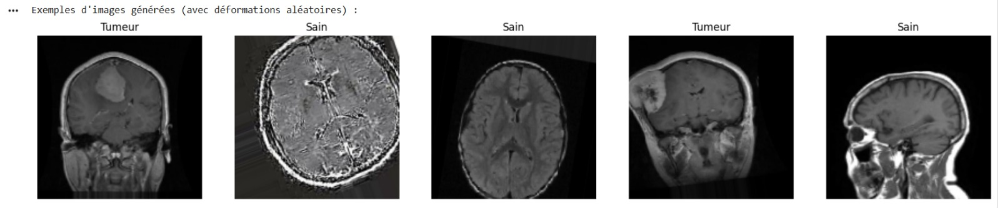
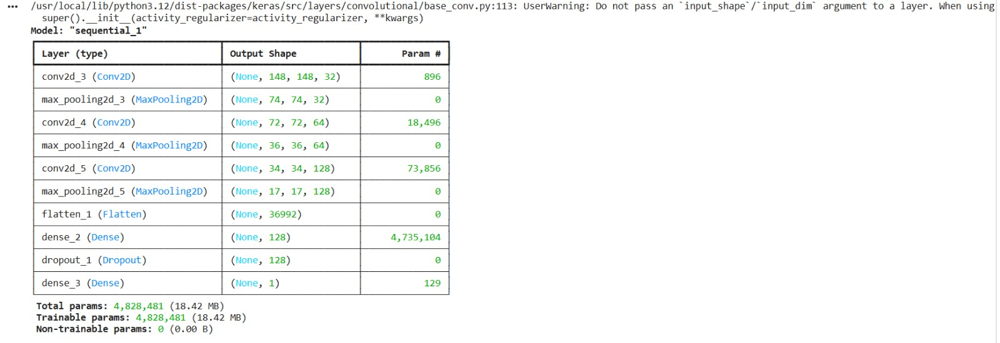
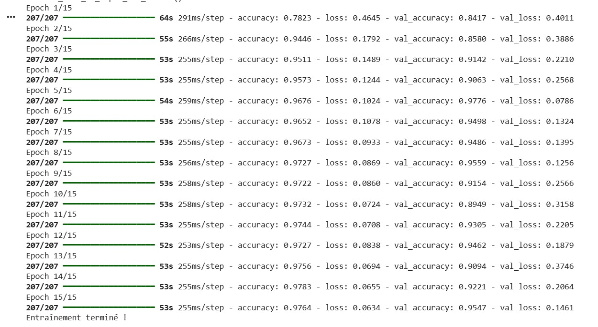

# 🧠 Brain Tumor Detection — CNN Standard

> **TP1 Deep Learning** — ENSA d'Oujda | Filière GSEIR-4 | 2025/2026  
> Classification binaire d'images IRM cérébrales par réseau de neurones convolutif

## 👩‍💻 Réalisé par

- **El Azimani Chaimae**
- **Bouras Jihane**

## 📌 Problématique

La détection manuelle de tumeurs cérébrales sur des images IRM est longue et sujette à erreur.  
Ce projet propose un modèle de **Deep Learning** capable de classifier automatiquement une image IRM en :
- ✅ **No Tumor** — Cerveau sain
- ⚠️ **Tumor** — Tumeur détectée

## 🎯 Objectifs

- Construire un CNN **from scratch** avec TensorFlow/Keras
- Appliquer la **Data Augmentation** pour améliorer la généralisation
- Évaluer les performances via courbes, matrice de confusion et rapport de classification

## 📊 Dataset

| Split | Nombre d'images |
|---|---|
| **Entraînement (80%)** | 6 622 images |
| **Validation (20%)** | 1 655 images |
| **Test** | 1 816 images |
| **Classes** | `no_tumor` (0) / `tumor` (1) |

### Exemples d'images IRM (avec Data Augmentation)

<p align="center">
  
</p>

## 🛠️ Partie Matérielle — Paramètres du Modèle

| Paramètre | Valeur |
|---|---|
| **Taille des images** | 150 × 150 pixels |
| **Batch size** | 32 |
| **Epochs** | 15 |
| **Optimizer** | Adam |
| **Loss function** | Binary Crossentropy |
| **Métrique** | Accuracy |

## 💻 Partie Logicielle (Software)

### 🧾 Technologies utilisées

| Technologie | Rôle |
|---|---|
| **Python 3** | Langage principal |
| **TensorFlow / Keras** | Construction et entraînement du CNN |
| **ImageDataGenerator** | Data Augmentation (rotation, flip, zoom, shear...) |
| **Matplotlib / Seaborn** | Visualisation des courbes et matrices |
| **Scikit-learn** | Matrice de confusion + rapport de classification |
| **Google Colab** | Environnement GPU cloud |

## ⚙️ Architecture du CNN

<p align="center">
  
</p>

Input (150×150×3)
      │
  ┌───▼────────────────────────────┐
  │  Conv2D(32, 3×3) + ReLU       │  → 896 params
  │  MaxPooling2D(2×2)             │
  └────────────────────────────────┘
      │
  ┌───▼────────────────────────────┐
  │  Conv2D(64, 3×3) + ReLU       │  → 18 496 params
  │  MaxPooling2D(2×2)             │
  └────────────────────────────────┘
      │
  ┌───▼────────────────────────────┐
  │  Conv2D(128, 3×3) + ReLU      │  → 73 856 params
  │  MaxPooling2D(2×2)             │
  └────────────────────────────────┘
      │
  Flatten → Dense(128) → Dropout(0.5)
      │
  Dense(1, Sigmoid) → [0 = Sain | 1 = Tumeur]

Total : 4 828 481 paramètres (18.42 MB)
```

### Résumé du modèle

<p align="center">
  
</p>

## ⚙️ Logique — Data Augmentation

Pour éviter l'overfitting et enrichir le dataset artificiellement :

```python
ImageDataGenerator(
    rescale        = 1./255,      # Normalisation [0-1]
    rotation_range = 20,          # Rotation aléatoire
    width_shift_range  = 0.1,     # Décalage horizontal
    height_shift_range = 0.1,     # Décalage vertical
    shear_range    = 0.1,         # Cisaillement
    zoom_range     = 0.1,         # Zoom
    horizontal_flip= True,        # Miroir horizontal
    validation_split = 0.2        # 20% pour validation
)

```

## 🔨 Entraînement

### Logs d'entraînement (15 epochs)

<p align="center">
  
</p>

## 📊 Résultats

### Courbes Accuracy & Loss

<p align="center">
  
</p>

> 📌 On observe que le modèle converge bien sur l'entraînement mais présente des **oscillations sur la validation**, signe d'un léger overfitting — corrigé dans TP2 avec MobileNet.

---

### 🎯 Évaluation Finale sur données de Test

| Métrique | Valeur |
|---|---|
| **Accuracy** | **95.04%** |
| **Loss** | **0.1054** |

---

### Matrice de Confusion

<p align="center">
  
</p>

| | Prédit : No Tumor | Prédit : Tumor |
|---|---|---|
| **Réel : No Tumor** | 909 ✅ | 1 ❌ |
| **Réel : Tumor** | 89 ❌ | 817 ✅ |

---

### Rapport de Classification

<p align="center">
  
</p>

| Classe | Precision | Recall | F1-Score | Support |
|---|---|---|---|---|
| **No Tumor** | 0.91 | 1.00 | 0.95 | 910 |
| **Tumor** | 1.00 | 0.90 | 0.95 | 906 |
| **Global** | **0.95** | **0.95** | **0.95** | 1816 |

---

### Prédictions sur images aléatoires

<p align="center">
  
</p>

> ✅ Le titre en **vert** = prédiction correcte | ❌ **rouge** = erreur  
> Le modèle affiche des probabilités élevées (97–100%) sur la plupart des cas.

---

## 🚀 Améliorations — Voir TP2

| Limitation TP1 | Solution TP2 |
|---|---|
| Oscillations validation loss | MobileNet → résultats plus stables |
| Overfitting possible | Transfer Learning + Fine-tuning |
| Entraînement long | Poids pré-entraînés ImageNet |

👉 **[TP2 — MobileNet Transfer Learning](https://github.com/VotreNom/brain-tumor-detection-mobilenet)**

---

## 📁 Structure du Dépôt

```
brain-tumor-detection-cnn/
├── README.md
├── CNN_Tumeurs.ipynb              ← Notebook Google Colab complet
├── images/
│   ├── irm_samples_augmented.jpg  ← Exemples dataset IRM
│   ├── architecture_cnn_code.jpg  ← Code architecture CNN
│   ├── model_summary.jpg          ← Résumé des couches
│   ├── training_logs.jpg          ← Logs entraînement
│   ├── courbes_accuracy_loss.jpg  ← Courbes training/validation
│   ├── confusion_matrix.jpg       ← Matrice de confusion
│   ├── classification_report.jpg  ← Rapport détaillé
│   └── predictions_finales.jpg    ← Prédictions visuelles
└── docs/
    └── tp1_rapport.pdf
```

---

## 🔑 Concepts Clés Appliqués

| Concept | Description |
|---|---|
| **CNN** | Réseau convolutif pour extraction de features visuelles |
| **Data Augmentation** | Enrichissement artificiel du dataset |
| **Dropout(0.5)** | Régularisation pour éviter l'overfitting |
| **Binary Crossentropy** | Fonction de perte pour classification binaire |
| **Sigmoid** | Activation finale → probabilité [0,1] |
| **Confusion Matrix** | Évaluation détaillée des prédictions |
